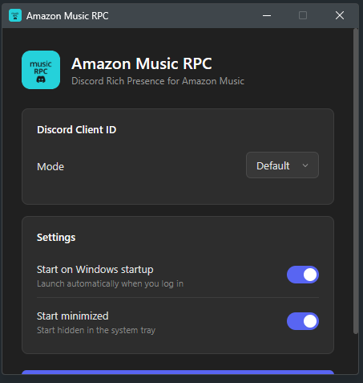

# Amazon Music RPC

Discord Rich Presence for Amazon Music on Windows. Shows what you're listening to — including track name, artist, album art, and a live timer — directly on your Discord profile.


## Preview

### Discord Rich Presence


### Settings UI



## Features

- **Live track display** — title, artist, album name, and elapsed time
- **Album art** — fetched automatically from Deezer (primary) and iTunes (fallback)
- **System tray app** — runs quietly in the background
- **Modern settings UI** — dark theme with WebView2 (Edge), Windows 11 style
- **Start on Windows startup** — optional, launches minimized to tray
- **Custom Discord Application ID** — use your own if you want custom assets

## How It Works

Amazon Music exposes currently playing media through Windows' System Media Transport Controls (SMTC). This app reads that data and sends it to Discord via Rich Presence IPC.

## Installation

### Installer (recommended)

Download `AmazonMusicRPC_Setup.exe` from [Releases](../../releases), run it, and you're done. The installer:

- Installs to `Program Files`
- Optionally creates a desktop shortcut
- Optionally adds a startup entry
- Shows up in **Settings > Apps** for clean uninstall

### From Source

```bash
git clone https://github.com/eripum9/Amazon-Music-Discord-RPC.git
cd AmazonMusic_rpc
pip install -r requirements.txt
python main.py
```

## Requirements

- **Windows 10/11** (64-bit)
- **Amazon Music** desktop app
- **Discord** desktop app (running)

No Python installation needed if using the Installer.

## Building

### Build the executable

```bash
pip install pyinstaller
pyinstaller AmazonMusicRPC.spec --noconfirm
```

The output goes to `dist/AmazonMusicRPC.exe`.

### Build the installer

Requires [Inno Setup 6](https://jrsoftware.org/isdl.php).

```bash
"C:\Program Files (x86)\Inno Setup 6\ISCC.exe" installer.iss
```

Or if installed via winget:

```bash
"%LOCALAPPDATA%\Programs\Inno Setup 6\ISCC.exe" installer.iss
```

Output: `installer_output/AmazonMusicRPC_Setup.exe`

## Configuration

Settings are stored in `%APPDATA%\AmazonMusicRPC\config.json` (or the project directory when running from source).

Right-click the tray icon and select **Settings** to open the configuration window.

## Credits

- [pypresence](https://github.com/qwertyquerty/pypresence) — Discord RPC library
- [winsdk](https://pypi.org/project/winsdk/) — Windows SDK bindings for SMTC
- [pywebview](https://pywebview.flowrl.com/) — Native webview for the settings UI
- [Deezer API](https://developers.deezer.com/) — Album art search
- [iTunes Search API](https://developer.apple.com/library/archive/documentation/AudioVideo/Conceptual/iTuneSearchAPI/) — Album art fallback
