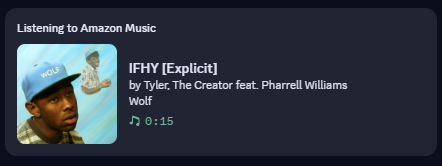
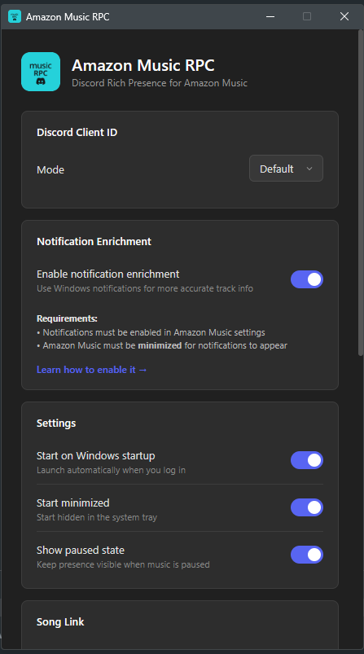

# Amazon Music RPC

Discord Rich Presence for Amazon Music on Windows. Shows what you're listening to — including track name, artist, album art, and a live timer — directly on your Discord profile.


## Preview

### Discord Rich Presence



### Settings UI



## Features

- **Live track display** — title, artist, album name, and progress bar with elapsed/total time
- **Album art** — fetched automatically from Deezer (primary) and iTunes (fallback)
- **Notification enrichment** — reads full artist and album info from Windows notifications for more accurate metadata than SMTC alone
- **Pause state** — keeps your presence visible when paused, with a frozen progress bar and pause icon
- **Last.fm scrobbling** — authenticate with one click and scrobble tracks automatically
- **ListenBrainz scrobbling** — paste your user token, validate it in Settings, and scrobble tracks
- **Listen on Deezer button** — adds a clickable link on your Discord presence (toggleable)
- **Auto-updater** — checks for updates on startup and via the Settings window
- **System tray app** — runs quietly in the background
- **Modern settings UI** — dark theme with WebView2 (Edge), Windows 11 style
- **Start on Windows startup** — optional, launches minimized to tray
- **Custom Discord Application ID** — use your own if you want custom assets

## How It Works

Amazon Music exposes currently playing media through Windows' System Media Transport Controls (SMTC). This app reads that data and sends it to Discord via Rich Presence IPC.

Optionally, notification enrichment can be enabled to read full track metadata (artist + album) from Amazon Music's Windows notifications, which provides richer data than SMTC alone. This requires Amazon Music notifications to be enabled and the app to be minimized.

## Installation

### Installer (recommended)

Download `AmazonMusicRPC_Setup.exe` from [Releases](../../releases), run it, and you're done. The installer:

- Installs to `Program Files`
- Optionally creates a desktop shortcut
- Optionally adds a startup entry
- Shows up in **Settings > Apps** for clean uninstall

### From Source

```bash
git clone https://github.com/eripum9/Amazon-Music-Discord-RPC.git
cd AmazonMusic_rpc
pip install -r requirements.txt
python main.py
```

## Requirements

- **Windows 10/11** (64-bit)
- **Amazon Music** desktop app
- **Discord** desktop app (running)

No Python installation needed if using the Installer.

## Building

### Build the executable

```bash
pip install pyinstaller
pyinstaller AmazonMusicRPC.spec --noconfirm
```

The output goes to `dist/AmazonMusicRPC.exe`.

### Build the installer

Requires [Inno Setup 6](https://jrsoftware.org/isdl.php).

```bash
"C:\Program Files (x86)\Inno Setup 6\ISCC.exe" installer.iss
```

Or if installed via winget:

```bash
"%LOCALAPPDATA%\Programs\Inno Setup 6\ISCC.exe" installer.iss
```

Output: `installer_output/AmazonMusicRPC_Setup.exe`

## Configuration

Settings are stored in `%APPDATA%\AmazonMusicRPC\config.json` (or the project directory when running from source).

Right-click the tray icon and select **Settings** to open the configuration window.

## Credits

- [pypresence](https://github.com/qwertyquerty/pypresence) — Discord RPC library
- [winsdk](https://pypi.org/project/winsdk/) — Windows SDK bindings for SMTC and notifications
- [pywebview](https://pywebview.flowrl.com/) — Native webview for the settings UI
- [pylast](https://github.com/pylast/pylast) — Last.fm API library
- [Deezer API](https://developers.deezer.com/) — Album art search
- [iTunes Search API](https://developer.apple.com/library/archive/documentation/AudioVideo/Conceptual/iTuneSearchAPI/) — Album art fallback
- [ListenBrainz API](https://listenbrainz.readthedocs.io/) — ListenBrainz scrobbling
